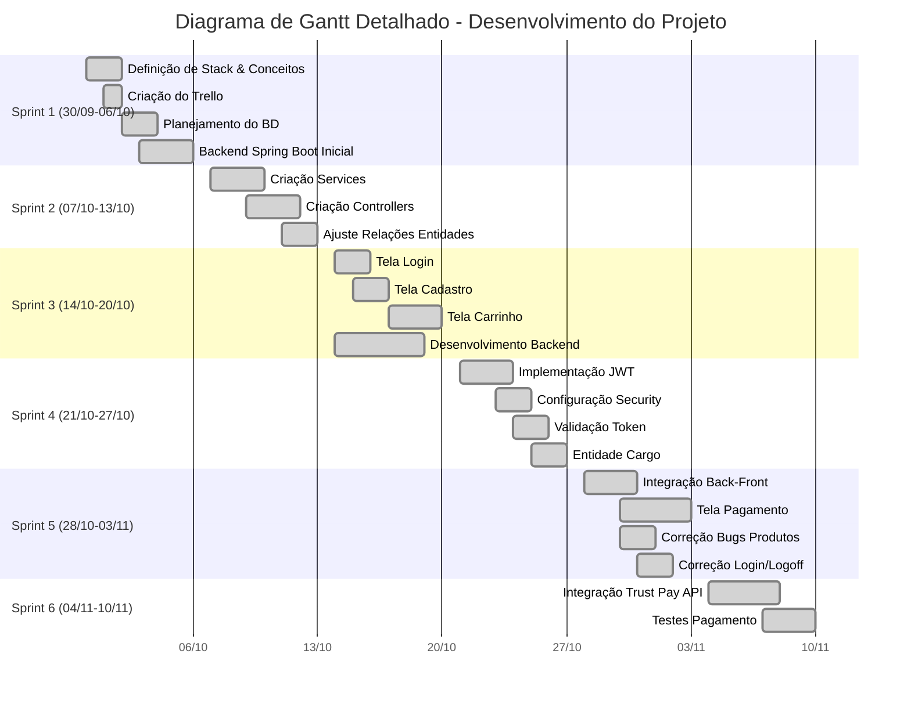

# Loja de Jogos — Backend

Este README documenta o backend Spring Boot da aplicação "Loja de Jogos".
Coloque prints de tela e qualquer anexo na seção "Screenshots" abaixo.

## Sumário

- Visão geral
- Funcionalidades
- Requisitos
- Variáveis de ambiente / application.properties
- Como rodar localmente
- Endpoints principais (resumo)
- Scripts / tarefas úteis
- Docker (build e run)
- Testes
- Debug / tips
- Screenshots (substitua pelos seus arquivos)

---

## Visão geral

O backend é uma API REST construída com Spring Boot. Ele fornece endpoints para gerenciar usuários, jogos, pedidos, categorias, autenticação e relatórios.

Estrutura principal:
- Pacote base: `Loja.Loja_de_Jogos`
- Controllers: `Controllers/` (ex.: `UsuarioController`, `GameController`, etc.)
- Services: `Services/` (lógica de negócio)
- Repositories: `Repositories/` (Spring Data JPA)
- Models: `Models/` (entidades JPA)
- DTOs: `dtos/` (objetos de transferência)

---

## Funcionalidades importantes

- Autenticação / autorização (filtros de token JWT)
- CRUD de usuários
- CRUD de jogos
- Listagem paginada de jogos/usuários
- Endpoint de contagem de usuários: `GET /api/usuarios/count` (retorna número total de usuários cadastrados)
- Endpoints para pedidos e carrinho
- Endpoints administrativos para relatórios e pagamentos

> Observação: algumas funcionalidades foram simplificadas para desenvolvimento (ex.: geração de chaves fake no frontend) e módulos relacionados a chaves persistentes foram removidos ou convertidos para stubs.

---

## Requisitos

- Java 17+ (compatível com Spring Boot 3)
- Maven (ou usar o wrapper `mvnw`/`mvnw.cmd` já incluído)
- Banco de dados PostgreSQL (Neon Postgres ou outro)
- Node/NPM apenas se for necessário rodar integrações frontend-local (opcional)

---

## Variáveis de ambiente / application.properties

As configurações de conexão ao banco e JWT ficam em `src/main/resources/application.properties`. Exemplo mínimo (substitua pelos seus valores):

```
spring.datasource.url=jdbc:postgresql://<HOST>:5432/<DBNAME>
spring.datasource.username=<DB_USER>
spring.datasource.password=<DB_PASSWORD>
spring.jpa.hibernate.ddl-auto=update
spring.jpa.properties.hibernate.format_sql=true
spring.jpa.properties.hibernate.jdbc.lob.non_contextual_creation=true

# Port (opcional)
server.port=8080

# JWT / Segurança (exemplos)
security.jwt.secret=troque-por-uma-chave-secreta
security.jwt.expiration=3600000
```

Se você usa o Neon Postgres, cole a URL JDBC provida pelo Neon em `spring.datasource.url`.

> Não comite credenciais sensíveis no repositório.

---

## Como rodar localmente

Usando o Maven Wrapper (recomendado):

PowerShell (Windows):

```powershell
./mvnw spring-boot:run
```

Linux / macOS (exemplo):

```bash
./mvnw spring-boot:run
```

A API vai iniciar em `http://localhost:8080` (ou na porta definida em `application.properties`).

---

## Endpoints principais (resumo)

> Use o Postman / Insomnia ou cURL para testar.

Usuários
- GET /api/usuarios — lista usuários (paginado ou lista simples dependendo do controlador)
- GET /api/usuarios/{id} — ver usuário por id
- POST /api/usuarios — criar usuário
- PUT /api/usuarios/{id} — atualizar (se implementado)
- DELETE /api/usuarios/{id} — deletar (se implementado)
- GET /api/usuarios/count — retorna número total de usuários (Long)

Autenticação (exemplos)
- POST /api/auth/login — autenticar (retorna token) (dependendo do controller de auth existente)

Jogos
- GET /api/jogos — listar jogos (paginação/filters)
- GET /api/jogos/{id}
- POST /api/jogos
- PUT /api/jogos/{id}
- DELETE /api/jogos/{id}

Pedidos
- GET /api/pedidos
- POST /api/pedidos

Observação: verifique as rotas reais em `Controllers/` pois nomes exatos podem variar.

---

## Scripts / tarefas úteis

- Compilar:
```powershell
./mvnw clean package
```
- Rodar testes (se existirem):
```powershell
./mvnw test
```

---

## Docker (opcional)

Se houver um `Dockerfile` multi-stage na raiz do backend, você pode construir e rodar a imagem:

```powershell
docker build -t loja-backend:latest .
# Rodar (exponha porta 8080 e configure variáveis de ambiente para DB)
docker run -e SPRING_DATASOURCE_URL="jdbc:postgresql://host:5432/db" -e SPRING_DATASOURCE_USERNAME=user -e SPRING_DATASOURCE_PASSWORD=pass -p 8080:8080 loja-backend:latest
```

---

## Testes e verificação rápida

- Verifique `GET /api/usuarios/count`:
```bash
curl http://localhost:8080/api/usuarios/count
```
Resposta esperada: um número (por exemplo `42`).

- Se a resposta for 401/403, confira se o endpoint exige autenticação e se o frontend está enviando token.

---

## Debug / problemas comuns

- CORS: se o frontend não consegue acessar o backend, verifique `@CrossOrigin` nos controllers ou configure CORS globalmente nas configurações de segurança.
- Banco: se o app não inicia, verifique a string JDBC, usuário, senha e se o banco aceita conexões (firewall, rede, Neon config).
- Dependências: rode `./mvnw dependency:resolve` se houver problemas de dependências.

# Nome de cada integrante e responsabilidade

| Nome     | Função de cada integrante     |
|---------------|---------------|
| Arthur Bonna  | Ajudou no planejamento das sprints    |
| Davi Tonn   | Ficou responsaval da maior parte do front-end em angular   |
| Kaio Levi   | Planejamento das sprints e ajudou um pouco no back-end   |
| Lucas   | Ficou responsavel por maior parte do back-end   |

# Sprints 

**SPRINT 1 - SEMANA 30/09 A 06/10**

**Objetivo da Sprint:** Planejamento inicial e estruturação do projeto

**Atividades Realizadas:**
- Definição da divisão de tarefas do projeto (stack, conceitos, funcionalidades principais)
- Criação do Trello para organização das tarefas
- Planejamento do banco de dados com definição das entidades:
  - Usuario, Jogo, RequisitoSistema, Categoria, Imagem, Key, Carrinho-jogo, Carrinho, Pedido
- Início do desenvolvimento do backend em Spring Boot
- Criação das classes básicas das entidades

**Entregas:**
- Board Trello organizado
- Estrutura inicial do backend Spring Boot
- Classes das entidades criadas

---

**SPRINT 2 - SEMANA 07/10 A 13/10**

**Objetivo da Sprint:** Estruturação das camadas do backend

**Atividades Realizadas:**
- Criação das pastas service e controller
- Ajuste das relações entre entidades para modelagem correta do banco de dados
- Configuração das dependências do Spring Boot

**Entregas:**
- Camadas service e controller implementadas
- Relacionamentos entre entidades ajustados

---

**SPRINT 3 - SEMANA 14/10 A 20/10**

**Objetivo da Sprint:** Início do desenvolvimento frontend e continuidade do backend

**Atividades Realizadas:**
- **Davi:** Desenvolvimento do frontend com criação das telas:
  - Login
  - Cadastro
  - Carrinho
- **Lucas:** Continuação do desenvolvimento backend

**Entregas:**
- Telas básicas do frontend criadas
- Progresso no desenvolvimento backend

---

**SPRINT 4 - SEMANA 21/10 A 27/10**

**Objetivo da Sprint:** Implementação do sistema de autenticação

**Atividades Realizadas:**
- Implementação do sistema de login com JWT (JSON Web Token)
- Configuração da classe de segurança
- Criação da validação de token
- Criação da entidade Cargo para controle de acesso

**Entregas:**
- Sistema de autenticação JWT funcionando
- Controle de acesso implementado
- Entidade Cargo criada

---

**SPRINT 5 - SEMANA 28/10 A 03/11**

**Objetivo da Sprint:** Integração frontend-backend e início da implementação de pagamento

**Atividades Realizadas:**
- Integração completa entre back-end e front-end
- Início do desenvolvimento da tela de pagamento
- Correção de bugs na tela de produtos
- Correção do sistema de login/logoff do usuário

**Entregas:**
- Sistema integrado funcionando
- Tela de pagamento em desenvolvimento
- Bugs críticos corrigidos

---

**SPRINT 6 - SEMANA 04/11 A 10/11**

**Objetivo da Sprint:** Implementação do sistema de pagamento

**Atividades Realizadas:**
- Integração da loja com API de pagamento Trust Pay
- Testes e validação do fluxo de pagamento

**Entregas:**
- Sistema de pagamento integrado e funcionando
- Fluxo completo de compra finalizado

---

**RESUMO DAS SPRINTS:**

| Sprint | Período | Foco Principal | Entregas |
|--------|---------|----------------|----------|
| 1 | 30/09-06/10 | Planejamento e estruturação | Trello, Backend base |
| 2 | 07/10-13/10 | Camadas do backend | Services e Controllers |
| 3 | 14/10-20/10 | Frontend inicial | Telas login, cadastro, carrinho |
| 4 | 21/10-27/10 | Autenticação | JWT e segurança |
| 5 | 28/10-03/11 | Integração e pagamento | Sistema integrado, tela pagamento |
| 6 | 04/11-10/11 | Pagamento externo | API Trust Pay integrada |

# Grafico GANTT


